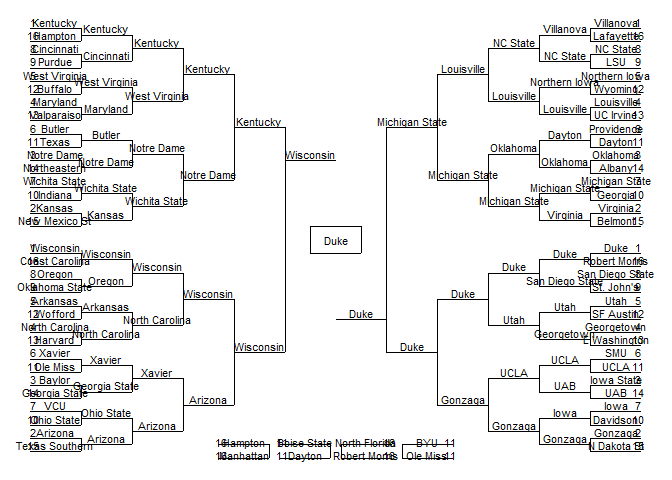

<!-- README.md is generated from README.Rmd. Please edit that file -->

# bRacketbusteRs

<!-- badges: start -->

[](https://github.com/npeters1322/bRacketbusteRs/actions)
[](https://app.codecov.io/gh/npeters1322/bRacketbusteRs?branch=master)
<!-- badges: end -->

The goal of bRacketbusteRs is to provide basic functions to work with
Kaggle’s 2021 March Mania competition data.

## Installation

You can install the development version of bRacketbusteRs by running the
following code in R:

``` r
devtools::install_github('npeters1322/bRacketbusteRs')
```

If you get errors related to the kaggler package, try installing that
package first by following [this
link](https://github.com/KoderKow/kaggler) and using the code in the
“Installation” section.

## Using the Kaggle Data

To use this package, users must be authenticated to use the Kaggle API
and must have accepted the terms of the competition. To set that up,
please follow these steps:

1.  Go to [Kaggle.com](https://www.kaggle.com/) and sign in or create an
    account.

2.  Find the March Mania competition by going to
    [this](https://www.kaggle.com/c/ncaam-march-mania-2021) page. Go to
    the data section and accept the terms if you have not already.

3.  Click on the icon of your profile picture in the top right and then
    click “Account.”

4.  Scroll down to the “API” section and click “Create New API Token.”
    It should automatically download a file called “kaggle.json” for
    you, which contains your username and API key.

5.  Save the “kaggle.json” file somewhere it will be easy to find later.

6.  Copy the “kaggle.json” file to “\~/.kaggle/kaggle.json” or install
    the [kaggler](https://github.com/KoderKow/kaggler) package and then
    follow the steps listed
    [here](https://koderkow.github.io/kaggler/articles/kaggler.html).

7.  After that, you should be all set to use the package!

## Examples of Using the Package

To download the data and read in any specific files of interest, try
this:

``` r
#download and read in data
getNCAAMData()
```

The data will be downloaded to your current working directory, so making
a project specifically for this is the best idea. Note that it may take
a little while to download all of the data. When the popup appears
telling you to choose files to read in, you can click cancel if you
don’t want to read any in right away; the data will still be downloaded
for you to read in later, either on your own or through the above
function again.

Then, explore the other functions, such as one that will calculate
per-game statistics for each team in each season. DIfferent data will be
used depending on whether you specify stage 1 or stage 2 data from the
competition. For example, you can calculate the mean, standard
deviation, or both, depending on your input, for several statistics.
Here’s an example of using both:

``` r
#using stage 1 data, calculate the mean and sd of several statistics
perGameStats(stage = 1, mean, sd)
#> # A tibble: 6,187 x 58
#>    Season TeamID meanScore sdScore meanOppScore sdOppScore meanFGM sdFGM meanFGA
#>     <int>  <int>     <dbl>   <dbl>        <dbl>      <dbl>   <dbl> <dbl>   <dbl>
#>  1   2003   1102      57.2   13.9          57        12.2     19.1  4.40    39.8
#>  2   2003   1103      78.8   15.3          78.1      12.8     27.1  5.07    55.9
#>  3   2003   1104      69.3   11.4          65         8.65    24.0  4.98    57.2
#>  4   2003   1105      71.8   13.1          76.7      14.0     24.4  4.73    61.6
#>  5   2003   1106      63.6   11.4          63.8      12.6     23.4  4.43    55.3
#>  6   2003   1107      65.9   11.7          75.7      13.7     24.0  4.17    57.5
#>  7   2003   1108      69.1    9.85         73.1      12.5     24.9  3.36    58.7
#>  8   2003   1110      66.4    8.85         61.9       8.49    23.2  3.92    53.5
#>  9   2003   1111      83.3   13.3          81.7      15.5     28.6  4.77    64.5
#> 10   2003   1112      85.2   10.4          70.2       9.36    30.3  3.94    65.7
#> # ... with 6,177 more rows, and 49 more variables: sdFGA <dbl>, meanFGM3 <dbl>,
#> #   sdFGM3 <dbl>, meanFGA3 <dbl>, sdFGA3 <dbl>, meanFTM <dbl>, sdFTM <dbl>,
#> #   meanFTA <dbl>, sdFTA <dbl>, meanOR <dbl>, sdOR <dbl>, meanDR <dbl>,
#> #   sdDR <dbl>, meanAst <dbl>, sdAst <dbl>, meanTO <dbl>, sdTO <dbl>,
#> #   meanStl <dbl>, sdStl <dbl>, meanBlk <dbl>, sdBlk <dbl>, meanPF <dbl>,
#> #   sdPF <dbl>, meanOppFGM <dbl>, sdOppFGM <dbl>, meanOppFGA <dbl>,
#> #   sdOppFGA <dbl>, meanOppFGM3 <dbl>, sdOppFGM3 <dbl>, meanOppFGA3 <dbl>, ...
```

The function also calculates the opponent statistics, too, so you
additionally have a lot of data about their defense.

There are many other similar functions that provide other variables,
such as tournament seeds, records, ranking statistics, and conference
tournament winners. Additionally, there’s a function that essentially
combines all of the other functions and produces a dataframe that
contains a large amount of variables that might be used to predict games
or make the process a little easier.

Another function produces an NCAA bracket that can have game winners
left out, true game winners included, or predicted game winners (by you)
filled in. For example, you can fill in the 2015 NCAA bracket with the
true winners by using this code:

``` r
ncaaBracket(season = 2015, filled = TRUE)
```



After running the function, you can click zoom in the “Plots” tab in
RStudio to make it full screen and read it easier. You can also then
choose to export it and print it if you want. In the future, this
function will be made more dynamic, allowing you to put your competition
submission in and having the function fill in the bracket based on that.

More functions will be made over time, and all will be updated for the
2022 competition. Even if none of the other functions are useful to you,
I hope the function to download and read in the data is and can help you
explore the data on your own.

## Notes

-   The developer is is no way affiliated with Kaggle or the creation of
    the kaggler package. Therefore, any changes to the API could cause
    breaks that cannot be fixed by the developer.

-   If you like to, or would like to, participate in other Kaggle
    competitions, make sure to check out the
    [kaggler](https://github.com/KoderKow/kaggler) package more to
    better integrate R and Kaggle.
